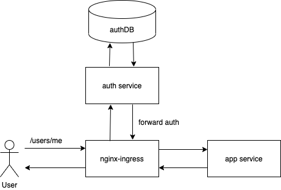

Архитектура решения




Запустить minikube 
```
minikube start --vm-driver= hyperkit\
 --vm=true
--cpus=4 --memory=8g \
--cni=flannel \
--kubernetes-version="v1.19.0" 
```

Включить ingress
```
minikube addons  enable ingress
```

Перейти в ./auth и запустить skaffold 

```
 skaffold run
 ```
Перейти в ./app и запустить skaffold 

```
 skaffold run
 ```

Запускаем тесты с помощью newman. 

```
newman run  postman_collection.json
```

 ```
newman

nginx forward auth

→ регистрация пользователя
  POST http://arch.homework/register [200 OK, 147B, 103ms]
  ✓  [INFO] Request: {
  "login": "Sunny10", 
  "password": "TyzQ0jy8qQHHkEB",
  "email": "Leilani31@gmail.com",
  "first_name": "Melba",
  "last_name": "Dickinson"
}

  ✓  [INFO] Response: {
  "id": 14
}


→ логин
  POST http://arch.homework/login [200 OK, 236B, 64ms]
  ✓  [INFO] Request: {"login": "Sunny10", "password": "TyzQ0jy8qQHHkEB"}
  ✓  [INFO] Response: {
  "status": "ok"
}


→ проверить данные о пользователе 
  GET http://arch.homework/auth [200 OK, 367B, 15ms]
  ✓  [INFO] Request: [object Object]
  ✓  [INFO] Response: {
  "email": "Leilani31@gmail.com", 
  "first_name": "Melba", 
  "id": 14, 
  "last_name": "Dickinson", 
  "login": "Sunny10"
}

  ✓  test token data

→ получить данные о пользователе
  GET http://arch.homework/users/me [500 Internal Server Error, 310B, 20ms]
  ✓  [INFO] Request: [object Object]
  ✓  [INFO] Response: <html>
<head><title>500 Internal Server Error</title></head>
<body>
<center><h1>500 Internal Server Error</h1></center>
<hr><center>nginx</center>
</body>
</html>


→ изменение данных пользователя
  PATCH http://arch.homework/update [200 OK, 263B, 87ms]
  ✓  [INFO] Request: {
  "email": "Ken_Deckow@hotmail.com",
  "first_name": "Rogelio",
  "last_name": "Schumm"
}

  ✓  [INFO] Response: {
  "email": "Ken_Deckow@hotmail.com", 
  "first_name": "Rogelio", 
  "id": 14, 
  "last_name": "Schumm", 
  "login": "Sunny10"
}


→ логаут
  GET http://arch.homework/logout [200 OK, 225B, 15ms]
  ✓  [INFO] Request: [object Object]
  ✓  [INFO] Response: {
  "status": "ok"
}


→ получить данные после разлогина
  GET http://arch.homework/users/me [500 Internal Server Error, 310B, 27ms]
  ✓  [INFO] Request: [object Object]
  ✓  [INFO] Response: <html>
<head><title>500 Internal Server Error</title></head>
<body>
<center><h1>500 Internal Server Error</h1></center>
<hr><center>nginx</center>
</body>
</html>


┌─────────────────────────┬───────────────────┬───────────────────┐
│                         │          executed │            failed │
├─────────────────────────┼───────────────────┼───────────────────┤
│              iterations │                 1 │                 0 │
├─────────────────────────┼───────────────────┼───────────────────┤
│                requests │                 7 │                 0 │
├─────────────────────────┼───────────────────┼───────────────────┤
│            test-scripts │                11 │                 0 │
├─────────────────────────┼───────────────────┼───────────────────┤
│      prerequest-scripts │                 9 │                 0 │
├─────────────────────────┼───────────────────┼───────────────────┤
│              assertions │                15 │                 0 │
├─────────────────────────┴───────────────────┴───────────────────┤
│ total run duration: 531ms                                       │
├─────────────────────────────────────────────────────────────────┤
│ total data received: 655B (approx)                              │
├─────────────────────────────────────────────────────────────────┤
│ average response time: 47ms [min: 15ms, max: 103ms, s.d.: 34ms] │
 ```

