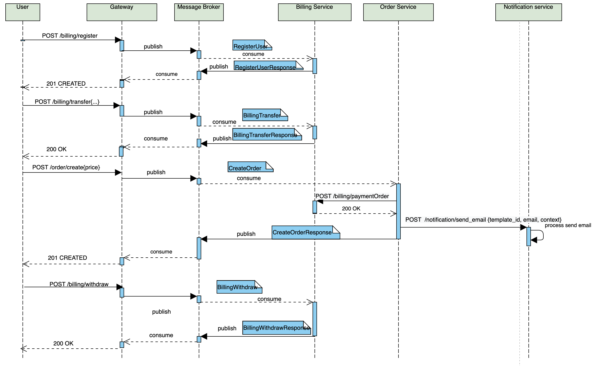

## Сценарий:

- Пользователь заходит на страницу регистрации. 
- Пользователь вводит в форму регистрации идентификационные данные и почту. 
- Пользователь нажимает на кнопку "Регистрация"
- Создается аккаунт пользователя в сервисе биллинга.
- Пользователь успешно зарегистрирован. 
- Пользователь пополняет свой аккаунт.
- Пользователь создает заказ, в параметре указывая цену.
- При создании заказа списываются деньги с аккаунта пользователя в сервисе биллинга.
- Отправлется сообщение пользователю на почту с результатом оформления заказа.
- Пользователь может снимать остаток денег с аккаунта в сервисе биллинга.

## RESTful

[Описание REST интерфейсов](http://petstore.swagger.io/?url=https://raw.githubusercontent.com/gigi090782/2021-06-otus-arch-Krasilova/api_spec/homework6/restful/rest-openapi.yaml)

## RPC over Message Bus

[Описание ASYNC интерфейсов](./message-bus/bus-asyncapi.yaml)

## Event Collaboration

[Описание ASYNC интерфейсов](./event-collab/collab-asyncapi.yaml)

